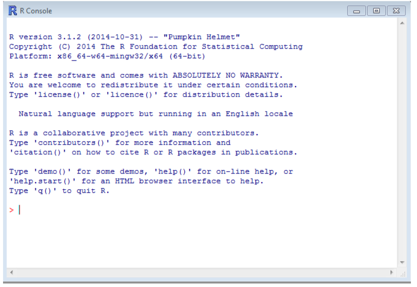

\newpage
\tableofcontents
\newpage 

# Basics of \R

## What is \R
You've already decided to learn \R\ so I don't need to write the congratulatory paragraph that opens nearly every \R\ tutorial.
But I will say a few nice things about \R.  Some of the things that \R\ is good at

- New methods are frequently released with an \R\  package or \R\  code.
- If new methods don't come with code you can write it yourself in \R.
- Methods like strategic estimators are, to my knowledge, not readily available in Stata, whereas they are straight forward in \R.
- I personally find data management easier to do in \R.
- \R\ plots are easy on the eyes.


## Course Aims and Structure
At the end of course sessions you should be able to 

- Install/Update \R\ and \R\ packages (1)
- Know where to look for \R\ help (1)
- Create simple programs and functions using \R\  (2) 
- Use control statements to program iterative procedures (2)
- Use \R\ to read and save data  (3)
- Effectively use matrices (1) and data frames (3) in \R\   
- Conduct basic statistical analysis with \R\ (5)
- Create tables (5) and plots (4) that can be exported directly into \LaTeX 

We should be able to cover all this in 4 or 5 sessions, each one lasting no more than an hour.
Today we'll just look at installing \R\ and \R\ packages, \R\ help, and some basic operations with vectors and matrices.

## Installing \R

To install \R\ for Windows

1. Go to [`http://cran.r-project.org/`](http://cran.r-project.org/)
2. Click on "Download \R\ for Windows"

](cran1.png)

3. Click on "base"

](cran2.png)

4.  Finally click on the big button download at the top of the page and run the file that it downloads

](cran3.png)

You how have \R\ installed on your computer.  Note the version number in the picture is old! But the process holds up.

To install \R\ on a Mac is largely the same.

1. Go to [`http://cran.r-project.org/`](http://cran.r-project.org/) \newpage

2. Click on "Download \R\ for (Mac OS X)"

](cran1.png)

3. Click on the version that matches your Mac

](cranMAC.png)

You how have \R\ installed on your computer. Again the pictures are old, but the process is true.

For Linux users you'll want to follow click on "Download \R\ for Linux" find your distribution and follow the instructions.

When you've finished installing \R\ open it up you should see something that looks like this:




As you can see in the picture, this version of \R\ is version 3.1.2, if we wanted more information about the type of \R\ we're running we can use the command `sessionInfo()` and we get
```{r}
sessionInfo()
```
Which shows us the version of \R\ we're using, our operating system (actually `r with(sessionInfo()$R.version, paste0(major,".", minor))`, again pictures are old!), and the packages we currently have loaded.
Since you haven't loaded any packages yet, the packages listed  are those that that \R\ loads automatically each time it opens (base packages).
\begin{note}
In the above chunk I have the several packages loaded as part of making these notes, which means my output has "other attached packages" and "loaded via namespace" your output will not have that.
\end{note}

RStudio is an excellent alternative to the \R\ console as it provides a nice system to edit your files while you're working on them and keep everything better organized.
To download RStudio visit \url{https://posit.co/download/rstudio-desktop/} and find the installer that matches your system.
I strongly recommend the use of RStudio over the regular \R\ console for ease of use and organization.


## Using \R\ as a Calculator
Now that we've gone through that ordeal, let's actually use \R\ for something.
When we open up \R\ we have the rather intimidating looking prompt staring at us.  Whenever we see
```{r, eval=FALSE}
>
  ```
  It just means that \R\ is waiting for us to give it something to do.  Let's start with something simple
  ```{r}
1+1
```
Which gives our answer and returns us to the `>`.  Now we don't have to fit everything on one line.  If we don't type a full command \R\ changes the `>` to a `>` to let us know that it needs more from us.  For example:
```{r, tidy=FALSE, prompt=TRUE}
2*
3
```
If for some reason you get the `+` and you don't know what went wrong you can hit the escape button on your keyboard and that stops \R\ and returns you to the `>`.  Escape will terminate anything \R\ is doing and return you to the `>` prompt.

All the basic operations work in \R\ so `+, -, *, /, ^` do addition, subtraction, multiplication, division, and exponents just as we would expect them to do. 
Additionally, standard functions are available so:
```{r}
log(10)  #base= e
log(10, base=10)
exp(1)
sin(0)
acos(-1)
```
Note that `#` is how we use comments in \R.  A comment is just a remark we put with our code but don't want \R\ to evaluate.
So after the `#` \R\ stops reading the line.


Also, \R\ can't do the impossible so
```{r}
log(0)
log(-1)
```
Where `-Inf` means $-\infty$ and `NaN` means "Not a Number."  
Getting those is a sign that you need to reevaluate what you're doing.

## Vectors and Variables
Now we want to use \R\ for more than just a calculator (your computer already has one of those).
So now we want to expand what we can do, the first way we'll do that is by assigning the output of our calculations to a variable.
In \R, an assignment can take many forms, and all of the following are the same.
```{r}
x <- exp(1)
x = exp(1)
exp(1) -> x
assign('x', exp(1))
```
For the most part, you'll only ever see the first two, and most \R\ users prefer the `<-`.
Once a value is assigned to variable we can use `x` like any other number and so
```{r}
x
x-2
log(x)
```
If we want to assign a new value to `x`  we just use the arrow again
```{r}
x <- exp(2)
x
```

### Naming Variables
We can name variables anything. Within code it is often better to use descriptive names.  The only rules about naming  variable is that it can't start with a number or contain any symbols except for periods and underscores.
```{r, tidy=FALSE, error=TRUE}
n <- 50 #Good but not descriptive
numberOfStates <- 50 #Good and descriptive
number.of.states <- 50 #Still good
number_of_states <- 50 #Still good
number-of-states <- 50 #Not good
```
As you can see the last one returned an error.
Using dashes made \R\ think we wanted to subtract the variable `number` minus the variable `of` minus the variable `students`.
If these variables had existed we would have gotten a different error because \R\ would think we wanted to assign the value 10 to this difference, which it would say is nonsense.

Notice that all of our output began with the symbol `[1]`, for example
```{r}
2+2
```
The `[1]` just means that \R\ thinks of this as a vector and the the `[1]` just tells you that the value next to it is the first number in the vector.
There's no reason why a variable in \R\ has to have only one value.  The simplest way to create vector is with the `c()` function.
For example
```{r}
x1 <- c(1, 2, 3, 4)
x1
```
Notice that the `[1]` is still there to tell us that the number next to it is the first value in the vector.
The `c` in this function just stands for "concatenate" and it can  be used to bring lots of vectors  together
```{r}
x2 <- c(1, 0, -1, 1)
c(x2, x2, x2, x1, x1, x1, x2, x2, x1, x1)
```
Where we can now see that whenever the output goes onto a second line we get a new indicator to tell us what position it is.
So in the above we have `[1]` at the beginning of the output and then `[26]` to tell us the value that starts the second line is the 26th value in the vector.

Nearly all the functions we looked at before work on vectors.  For instance
```{r}
x1+x2
x1/x2
log(x1)
```
And there are some nice functions to describe vectors.
```{r}
sum(x1)
prod(x1)
mean(x1)
median(x1)
sd(x1)
```
We can also sort the values within a vector
```{r}
sort(x1)
sort(x1, decreasing=TRUE)
length(x1)
```

### Easier ways to Create Vectors

If we want to create a vector that follows a pattern, we don't need to take the time to type it in.
For instance if we just want all the numbers between 1 and 15 in a vector we can use the colon.
```{r}
1:15
5:2
```
Notice that \R\  reads the second one as a sequence from 5 to 2, and so it goes in decreasing order.  The more general version of the colon is the `seq()` command
```{r}
seq(0, 20)
seq(0, 20, by=2)
seq(0, 20, length.out=5)
```
Finally  the `rep` command allows you to repeat numbers
```{r}
rep(10, 2)
rep(x1, 3)
rep(x1, each=3) #Repeats each number within x1 one at a time
```

### Indexing
Let's say we want to extract or replace a single number within a vector. In these cases we use the square brackets, for example
```{r}
z <- seq(0, 6, by =2)
z[3] #3rd entry
z[1:3] #1st three entries
z[c(1, 3)] #Entries 1 and 3, note that we need c()
z[-c(1,3)] #Everything but 1 and 3
```

We can also extract based on a pattern using logical operators.  Let's say we only want elements of `z` that are greater than 10. The logical statement is
```{r}
z > 3 
```
Which returns a vector of `TRUE` and `FALSE` values to show if a particular element in `z` meets the condition we gave it.  Now in order to use that to get the elements we want do the following:
```{r}
z[z>3]
```
The  list of commonly used logical operators  is shown in table \ref{LO}
\begin{table}[H]
\centering
\caption{Logical operators}
\label{LO}
\begin{tabular}{cl}
Operator  	& Meaning\\ \hline
\texttt{<}				 		& less than\\
\texttt{<=}					& less than or equal to\\
\texttt{>}						& greater than\\
\texttt{>=}					& greater than or equal to \\
\texttt{==}					& equal \\
\texttt{!=}						& Not equal\\
\texttt{!	}						& Not\\ \hline
\end{tabular}
\end{table}
Logical conditions can be strung together use `&` (and) and `|` (or)
```{r}
z > 3 & z< 5
z[z > 3 & z < 5]
z[z < 3 | z > 5]
```
### Removing Objects
We use the `ls()` command to view all the objects that we've created
```{r}
ls()
```
Now lets say we wanted to get rid of some things.  For this we use the `rm()` command, but be careful, there's no undo for this.
```{r}
rm(list='number.of.states')
ls()
rm(list=c('x1', 'y2')) #We can delete more than one thing at time.
ls()
rm(list=ls()) #We can delete everything
ls()
```
It's worth noting at this point that a vector doesn't have to be numbers it could be
```{r}
x <- c('cat', 'dog', 'horse')
```
Until we get more into data analysis there isn't a whole lot of reason to get into strings.
I will note that the `stringr` package contains many good tools for manipulating string variables should you find yourself needing to do that.

## Matrices
A matrix is just a 2 dimensional version of the vector.  To create a matrix you just need a vector of values and then tell \R\ one of the dimensions
```{r}
x <- 1:10
matrix(x, nrow=2)
matrix(x, ncol=2)
```
Notice that \R\ fills in the numbers column-wise, but we can also fill in row wise
```{r}
matrix(x, ncol=2, byrow=TRUE)
```
We can also use `cbind` and `rbind` to "bind"  vectors together to make a matrix, bind a vector(s) to a matrix, or bind matrices together
```{r}
x2 <- -10:-1
cbind(x, x2)
rbind(x, x2)
z <- 1:5
cbind(x, x2, z)
```
Notice that there's no limit to the number of things we can bind together in one use of `cbind`.

The `diag` command has a few different uses.
```{r}
diag(4) # 4 x 4 identity matrix
diag(x) #A square matrix with diagonal = x
Z <- matrix(1:9, nrow = 3)
Z
diag(Z) #Extract the diagonal of a square matrix
```

If for some reason you wanted to turn a matrix into vector there are few ways to do that
```{r}
c(Z)
as.vector(Z)
```
if you have any doubts about whether something is a vector you can always check its class
```{r}
class(x)
class(Z)
```

### Matrix Attributes
Just like with vectors we can use the square brackets to extract elements.  For a matrix `X`, the command `X[i, j]` gives you the element from row `i`, column `j`.
```{r}
X <- matrix(1:12, nrow=3)
X
X[2, 4]
```
As before we can replace individual elements
```{r}
X[3,2]<-8
X
```
We can also extract whole rows and columns
```{r}
X[1, ]  #First row
X[, 2]  #Second Column
X[1:2,] ##First two columns
```
Notice that when we pull out just one row or column \R\ converts it into a vector, we can use the `drop` argument to stop that
```{r}
X[1, ,drop=FALSE]
class(X[1, ,drop=FALSE])
```
As before we can use the logical operators
```{r}
X[, 2] == 8 # which rows have 8 in the second column?
X[X[, 2] == 8, ]
```
For the most part \R\ treats matrices as just vectors that are written differently, this means that if we ask \R\ for things like length, mean, and standard deviation it gives it to us for all the values.
```{r}
length(X)
mean(X)
sd(X)
```
Some things will work on directly on matrices, such finding the shape
```{r}
dim(X) #dimensions of X
nrow(X) #rows of X
ncol(X) #columns of X
```
But what if we wanted means by column?
This takes us to our first introduction of the `for` loop and the `apply` function.
We will cover them in greater detail later but for now let's start with `for` loop.
```{r}
mean.x <- rep(0, ncol(X)) #Recall that this creates a vector of 0s
#equal to the length of ncol(X)
for(i in 1:ncol(X)){
  mean.x[i] <-  mean(X[,i])  #What does this do?
}
mean.x

apply(X, 2, mean) # Same thing

colMeans(X) #Best way to do this!
```
Notice that both of the loop and `apply` do the same thing, but that apply is much easier to write. So let's break down what these things do. Before we even ran the `for` loop we created a vector in which to store the results.
We filled the vector with 0s but we really could have filled them with anything.
I like using 0s because it makes it easy to spot if something goes wrong.
Zeros are also better than missing values `NA` because they don't involve changing types (non-number to number) as you fill in the vector.
The second thing we did was start the loop the line `for(i in 1:ncol(X))`  just tells \R\ that we're going to use a variable `i` that takes the values `1, 2, ..., ncol(X)`, and once `i` takes the last value in that sequence the loop is done.
The curly brackets tell \R\ the extent of the loop.

The `apply` function on the other hand takes 3 arguments.  
The first is a matrix, in this case `X`. 
The second is a direction, 2 means that we want \R\ to apply the function over columns, 1 would mean we wanted to apply it over rows.  
The last argument is a function, in example we just used means, but it could be any function, including one you write yourself once we get to writing functions.

Finally, for this specific example there is a built in function `colMeans` (and `rowMeans`) that is faster than either `for` or `apply`, but that won't be the case for every operation you want to do.


Note that one thing we can do with matrices that we can't do with vectors is name the rows and the columns.  These names are just string vectors.
```{r}
X <- diag(2)
colnames(X)
colnames(X) <- c('left', 'right')
X
colnames(X)[2] <- 'Right'
X
row.names(X) <- c('up', 'down')
X

X[,'left']  ## We can use the names in place of numbers to index
X['up', 'left']
```

### Matrix Operations
Matrix math in  \R\ includes  standard operations including arithmetic.
```{r}
X <-  matrix(1:4, nrow=2)
Y <- diag(2) #Identity matrix
X + Y
X-Y
```
Note that `*` performs \emph{element-wise} multiplication. 
In the coming weeks you'll learn more about matrix operations, as you do you'll find the following functions/operators useful

1. Matrix multiplication `X %*% Y`
2. Matrix inversion `solve(X)`
3. Matrix transpose `t(X)`
4. Determinant `det(X)`
4. Eigenvalues and eigenvectors `eigen(X)`
5. Cholesky decomposition `chol(X)`


## Lists
When \R\ returns a list to us we can extract the elements of it using the dollar sign with the appropriate name.
The names are given by the output, in the above example the names given to us are "values" and "vectors."
If we didn't know the names we can look using the `names` command.
Let's make our own list and then try it 
```{r}
Y <- matrix(c(1, 0.5, 0.5, 1), nrow=2)
matrixList <- list(matrix = diag(4), #Identity matrix
                   Y = Y,
                   nrowsY = nrow(Y))

names(matrixList)
matrixList$matrix
matrixList$Y
```
Alternatively, we can still use brackets, but with lists we have to double them up to get the specific element extracted from the list. For example, compare
```{r}
matrixList[3]
matrixList[[3]]
```
Lists are very flexible because they are way to combine matrices of different dimensions with vectors, or to put many statistical models together in one group. We can also nest lists within lists.  
```{r}
matrixList$sizeY <- list(rows=nrow(Y), cols=ncol(Y))
```
If we wanted to extract just the columns from this list we could use either the names or the square brackets.
```{r}
matrixList$sizeY$cols
matrixList[[4]][[2]] #Same thing
```

Finally, we have two more forms of apply that we can use on just lists.
The first one we'll look at is `lapply` which is read "L- Apply" and stands for list apply.
When we use `lapply` it performs some function that we want over the entire list.
So if we wanted to know the length of each object in a list we could do the following.
```{r}
lapply(matrixList, length)
```
Notice that `lapply` returns  a list, this can be rather cumbersome, which is why we sometimes use `sapply` instead.
The `sapply` command does the same thing but returns the results in  vector form if possible.
```{r}
sapply(matrixList, length)
```
Other *ply functions exist, notably, `tapply` (apply a function over a group) and `mapply`, but I don't find myself using either of those very much, so we'll leave it at that.


In most of the really useful applications of these functions we would have a list where all the elements were of the same class.  Let's say we have a bunch of matrices and want to know the column means of each one.
```{r}
matrixList <- list(matrix1 = matrix(1:9, nrow=3), 	#3 x 3
                   matrix2 = matrix(0:5, nrow=2), 	#2 x 3
                   matrix3 = cbind(rnorm(3), 1))   	#3 x 2
matrixList
lapply(matrixList, class) # make sure they're all matrices
lapply(matrixList, dim)   # check dimensions
lapply(matrixList, apply, 2, mean)
```
Notice that in the last one we used `apply` within `lapply`.
We then just write the arguments that we would use with apply as additional arguments.
This is something that we can generally do with functions in the apply family. For example
```{r}
X <- matrix(c(1, NA, 1,1), nrow=2) #Row 2 has a missing value
mean(X[2, ])  #is NA
mean(X[2, ], na.rm=TRUE) #Tells R to just ignore missing values
apply(X, 1, mean) #Gives us that NA
apply(X, 1, mean, na.rm=TRUE) #add option na.rm=TRUE
```

## Packages and Updating
To install a  package (in this case MASS) from CRAN (99.9\% of the packages you want will be here) you just run the command
```{r, eval=FALSE}
install.packages('MASS')
```
\noindent it may ask you to pick a mirror. I usually pick one from Pennsylvania, but it really doesn't matter which one you pick.
Once it's installed you can load it.
```{r}
library(MASS)
```

### Updating \R\ and \R\ Packages

To update \R\ there are 3 steps

1. Download the new version
2. Install it
3. Uninstall the old version 

In most cases that's all you'll need to do. 


To update a package just run `install.packages()` again. RStudio has a button in the packages tab that says `Check for Updates.'

## Getting Help

This is probably the most important part of the whole course.
If you run into a problem, which will happen often, there are two things that are almost always true:  

1. Someone else has had this problem 
2. Someone has solved it.


**Finding out about a particular function:** The most common problems are related to particular functions that you want to know more about.  In these cases the best place to start looking is the \R\ help file.  These can be accessed using the ? command.  For instance if we wanted to know more about the arguments in `log`, say we didn't know that it was base $e$ or we didn't know how to change it we could type

```{r, eval=FALSE, tidy=FALSE}
?log
```

Which pulls up the help file.  A typical \R\ help file consists of a few sections

- **Description** What is the function supposed to do?
- **Usage** How does one typically type the command?
- **Arguments**  What are all the arguments and what do they do?
- **Details** Additional information about how the function works
- **Value** What does the function return?  If the function returns a list, what are the elements of that list?
- **See Also** Related functions that may be helpful
- **Example** Examples of how to use the function.

This is usually good enough to figure anything you want to know about a function, and running the examples at the bottom of the page can be helpful in understanding the output.
Note that if for some reason ? doesn't work you can also use type
```{r, eval=FALSE}
help('%*%')
```

and it will do the same thing.

**You know what you want to do, but you don't know what function to use:** In these cases the commands `??` or `help.search` are your friends.  They do a keyword search through the help files or all your packages to find what you're looking for.  For example,

```{r, eval=FALSE}
help.search("multivariate normal")
```

Searches the help files for mentions of multivariate normal.  One result that looks promising is

\begin{verbatim}
MASS::mvrnorm  	Simulate from a Multivariate Normal Distribution
\end{verbatim}
Which means that there is a function in the MASS package called `mvrnorm`.

**If neither of those works:** 

1. Google will almost certainly find you the answer you want.  Googling `How to do XYZ in R''  will almost always guide you to the right place.  There are few websites that deal with \R\ questions and the answers are almost always helpful.  Results from \url{www.stackoverflow.com} are usually very helpful and easy to follow.
2. ChatGPT and similar AI can also be very helpful at answering your questions.

## Exercises

1. Look up the function `rnorm` using the `?` function.  Read about its arguments and its related functions (`pnorm`, `dnorm`, etc),  we will use it in the next problem.
2. Do the following
    a. Create a $15 \times 3$ matrix, call it `X` where the first column is all 1s, the second column contains random draws from a normal with mean 1 and standard deviation 2 (hint: look at problem 1) and the last  column contains random draws from the uniform distribution [0, 1] (use `??` or google to try and find the function for this).  Use any of the methods discussed above to create the matrix.  Look up and use the function `colMeans` to  print the column means  for each column and use `apply` to print standard deviations of each column to make sure you that you did this correctly (the standard deviation for $U[0, 1]$ will be between 0.27 and 0.30)
    b. Create a vector `b` equal to (-1, 2, 2).  Then change the second value to -2.
    
3. Install the following packages:
    - `dplyr`
    - `xtable`
    - `ggplot2`
    


# Control Statements and Programming
This chapter really takes us into the meat of \R\ programming.

## If and else
When we want to use logical conditions we can use `if` and `else` as separate commands.  They have the following setup:
\begin{verbatim}
if(LOGICAL){
  COMMAND1
  COMMAND2
}else{
  COMMAND
}
\end{verbatim}
Notice the use of `{}` to contain the conditions.
While you sometimes find code that does not use these (you don't need them for one line statements), I *strongly* encourage you to always be explicit and use them as much as possible.
This makes your code less prone to breaking and much more readable to you, others, and, perhaps most importantly, your future selves.

Let's look at an example of a trivial if statement.
```{r}
y <- FALSE
if(y){
  cat("Hello World")
}else{
  cat("Goodbye")
}
```

We can also nest if statements.  Try  the following:  Generate a value of `test` and predict which name will be printed.
Make sure you understand why a given name is being displayed.
```{r}
test <- runif(1)
print(test)

if(test < 1/2){
  if(test < 1/3){
    "Mary"
  }else{
    if(test < 0.4){
      "Frank"
    }else{
      "Liz"
    }
  }
}else{
  "Bob"
}
```

Sometimes if and else can be quite cumbersome, and for special cases \R\ comes with a neat `ifelse` command.
This command takes the syntax
\begin{verbatim}
ifelse(LOGICAL,
       IF TRUE: DO THIS,
       ELSE: DO THIS)
\end{verbatim}
This can be used on vectors of logicals in ways that don't make sense for the if-else constructs we used above.
Let's try it:
```{r}
test <- runif(10)
print(test)
ifelse(test < 1/2,
       0,
       1)
```

As with if-else constructs we can also nest them
```{r}
print(test)

ifelse(test < 1/2,
       ifelse(test < 1/3,
              "Mary",
              ifelse(test < 0.4,
                     "Frank",
                     "Liz")),
       "Bob")
```
Were you able to predict them all correctly?
If you did then you understand what's going on here.

## Loops and breaks
Another commonly used control structure is the loop.  We saw a `for` loop earlier, which iterates a fixed number of times, but what if we didn't know how many times something needed done though, we just know when it's done?
This takes us to a second type of loop: `while`

```{r}
#Create initial value of y that doesn't satisfy the condition
y <- 1
while(y>0.05){
  y <- runif(1)
}
y
```


## Scripting
Now that we're starting to get the hang of doing things in \R\ we're now at the point where we'll want to write them down so we can redo and replicate our work.
Everything you do in \R\ should take the form of a script (e.g., problem sets, research), so that you can edit, reproduce, remember what you've done, and share it with others.
Our first script will be a program that generates some data and then provides some descriptive statistics of that data.
To create a new script file in \R\ go to `file>New script`. In RStudio go to `file>New>R Script`.  In both cases we now have a blank file.
Save this file somewhere (remember where) as "test1.R" and then enter the following
```{r,tidy=FALSE, eval=FALSE, prompt=FALSE}
######Heading#####
##File: test1.R
##Description: First R script

######Generate some data######
dat <- rnorm(1000)  ##Creates a vector of normal draws

######Create a function to summarize it######
summarize <- function(x){  ##This creates a function that takes one
  ##Argument, we've called x, it can be anything
  
  ##Make a vector with summary stats
  ans <- c(Mean = mean(x),
              StDev = sd(x),
              Min = min(x),
              Median = median(x) ,
              Max = max(x))
  return(ans) ## Return the list we created
} ## end the function
summarize(dat) ##run the function on the data
```
Once you have that typed, re-save the file.  We can now run the file using the `source` command.    
To do this you'll want to have your working directory set to wherever you saved the file.
You can set your working directory using `setwd()` 
```{r}
getwd() ##Returns the current working directory
setwd('~/Dropbox/Rcourse_2021update') ##Change
getwd() ##Returns the new directory
```
\begin{note}
All \R\ scripts should be written with a working directory in mind and use "relative" rather than "absolute" paths. You should also never include a `setwd` command in your scripts. When you send a script or project to someone it should be self contained in the sense that they should be able to download it and run it from whatever directory they save it to.
\end{note}
In my case this means that I set my working directory and then run:
```{r}
source('test1.R', echo=TRUE) 
```
Alternatively you can run individual lines  by highlight them in the file editor and press ctrl+enter.  RStudio also has a source button in built into the editor.
We can also dispense with the full extension by changing our working directory.


Now that we've sourced the file the variable `dat` and the function `summarize` are now in our working space. To see this
```{r}
ls()
```
Which means we can now use our `summarize` function just like any of the built in \R\ commands. For example
```{r}
X <- cbind(rnorm(1000), 1:1000)
apply(X, 2, summarize)
```


# Data Frames and tables
Today we'll be focusing on one particular type of object, the data frame.
Data frames in \R\ are used for data manipulation and data analysis because they offer a few advantages over the standard matrix, the advantages that they offer are:

- Each column in a data frame can be of a different class (numeric, character, factor). All the columns in a matrix must be the same class (numeric, character).
- Data frames can be merged together, the `merge` command doesn't work on matrices
- Most canned regression models are designed to work with data frames rather than matrices
- It's easier to extract individual variables out of a data frame

Because data frames are pretty essential to most applications of \R\ we'll be doing a lot of specific applications. 
Two common add-ons to data frames are data tables the tidyverse. We will briefly discuss these throughout, but our main focus will be on base \R\ data frames since they are the work horse. 
You will at some point want to supplement your knowledge by using either tidyr or data tables (or both).


## Reading data

One advantage of \R\ over other statistical packages is that it has the ability to read many different kinds of data.
The two standard read commands are for tab and comma separated data and they are `read.table` and `read.csv`, respectively.
It's easy to save excel files into comma separated data (.csv), and I would recommend this over using tools explicitly designed for excel files.
For many purposes the combination of `read.csv` will get you where you want to go however, there are lots of times when the data can only be obtained in Stata (.dta) or other proprietary formats.
The `foreign` package allows for reading older Stata files only, but it does allow for SAS, SPSS, S+, minitab, .dbf files (GIS data is often in .dbf form) and other data formats, so you may also find that useful.


For newer Stata files you can use either \verb@readstata13@ or \verb@haven@.
Haven is part of the "tidyverse" which is a set of packages that form an easy and increasingly popular way to do things in \R.
I also like \verb@data.tables@ as a faster alternative to the tidyverse. 
For each thing today we'll talk about the base and tidy way to do things. I will eventually include the data table ways as an appendix to this chapter.


The tidyverse has several packages for reading data \verb@haven@ for dta files, \verb@readr@ for most text data (csv, txt, tab),  and \verb@readxl@ package for excel-style files (xls and xlsx).
To see these in action, we'll read in the data files that I sent you this morning.
In addition to reading data from outside sources, many \R\ packages (including the base packages) come prepackaged with datasets which can be accessed using the \verb@data@ function


In addition to reading data from outside sources, many \R\ packages (including the base packages) come prepackaged with datasets which can be accessed using the `data` function
```{r}
# Tidy packages
library(dplyr)

#Alternative 
library(data.table)

# for stata files (i like it better than haven)
library(readstata13)
##Notice that I use relative paths below. You should use the setwd()
##command that we learned before to change your working directory to 
##directory that contains the datasets folder **before** trying these examples


##ordinary csv
NMC <- read.csv('Datasets/NMC_Supplement_v4_0.csv')

##stata dataset
FL2003 <- read.dta13('Datasets/FearonLaitin_CivilWar2003.dta') 
# A warning. Let's do what it says
FL2003 <- read.dta13('Datasets/FearonLaitin_CivilWar2003.dta',
                     nonint.factors=TRUE,
                     convert.dates = FALSE) #annoying change in newer versions

class(NMC)
class(FL2003)
```
Notice that  the class here is `data.frame` which is what we're into.
<!-- Also note, that `read_csv` includes some extra info about the file that's loaded.  -->
<!-- We can suppress that with the option `show_col_types=FALSE`. -->
<!-- Now we've read in the data we can take a look at it. -->
Now we've read in the data we can take a look at it.

## Commands to use on Data

### Looking at the Variables
Once we've read in the data we may wish to look at it.  This can be accomplished using the `View` command.
This command opens up a new window where we can see the data just like we would using the browse command in Stata, there is also the command `fix` which is the equivalent of the edit command in Stata.
```{r, eval=FALSE}
View(NMC)
fix(NMC)
```
There is also an easy way to just look at the first few observations of a data.frame.  This is helpful just to see what the variables look like without actually looking at the whole dataset.  This can be done using the `head` command.  Additionally, the command `summary` can be used to get a summary of each column in the data frame; we can also look at just the variable names using the command `colnames```
```{r}
head(FL2003) #Top  6
tail(FL2003) #Last 6
summary(FL2003[, 1:10]) ##Truncated the first 10 columns to save space
colnames(FL2003) 
```
It's worth noting at this point that all of commands just mentioned work on matrices, and everything but `colnames` works on ordinary vectors.

### Individual Variables
\R\ treats data frames like a special version of a list.
This means that to access individual elements we use the dollar sign.
For example if we want just the summary of the `pop` variables in Fearon and Laitin we would type.
```{r}
summary(FL2003$pop)
```
We could also use numbers to index like with matrices
```{r}
summary(FL2003[,18]) ##But isn't the dollar sign easier?
```
Extracted variables are just vectors and so we can treat them as such
```{r}
## Doing vector stuff with variables
FL2003$pop[1:10]
head(log(FL2003$pop)) 
```


### Creating Subsets
We can also use index to create subsets of data frames, for instance if we just wanted the COW codes and years we could do any of the following to create that subset.
```{r}
##These all do the same thing
temp.dat <- FL2003[, c('ccode', 'year')]
head(temp.dat)

temp.dat <- FL2003[, c(53, 2)]
head(temp.dat)


temp.dat <- subset(FL2003, select=c('ccode', 'year'))
head(temp.dat)

## Tidy approach
temp.dat <- FL2003 %>% 
  select(ccode, year)
head(temp.dat)

## DT approach
FL.dt <- data.table(FL2003) #need to convert first
temp.dat <- FL.dt[,.(ccode, year)]
head(temp.dat)
```

In general, `subset`, `select`, or the `data.table` approaches are probably better than any of the other alternatives depending on whether you like base, tidy, or data table ecosystems. 
Take a second to look up `with`, it can be helpful with data frames when working in base.

Note that we have introduced the tidy `%>%` function.
This operator connects functions in the tidyverse. Instead of `f(g(x))` we write `x %>% g() %>% f()` which can make for more readable code as it goes in the order of operation.

We can also subset based on rows
```{r}
##These all do the same thing
temp.dat <- FL2003[FL2003$ccode ==2, ] ##Extract USA 
head(temp.dat)

temp.dat <- subset(FL2003, subset = ccode==2)
head(temp.dat)

#tidy
temp.dat <- FL2003 %>% 
  filter(ccode==2)
head(temp.dat)

# data table
temp.dat <- FL.dt[ccode==2]
head(temp.dat)
```
Note that `subset` is used in base for both rows and columns.
If we pull up the help page on `subset` (`?subset`) we can see that the subset argument takes a logical expression (in this case `ccode==2`) for selecting rows that we want.
The select argument takes column names for the columns that we want.
We can use them to together
```{r}
temp.dat <- subset(FL2003, 
                   subset = ccode==2, 
                   select=c('year', 'polity2'))
head(temp.dat)
dim(temp.dat)


#tidy approach
temp.dat <- FL2003 %>% 
  filter(ccode==2) %>% 
  select(year,polity2)
head(temp.dat)
dim(temp.dat)

# Data table
temp.dat <- FL.dt[ccode==2, .(year, polity2)]
head(temp.dat)
dim(temp.dat)
```


<!-- \begin{note} -->
<!-- I include the expression \texttt{!is.na(FL2003\$ccode)} as a precaution when we do indexing.   -->
<!-- If we don't include this and there are NAs (Missing Values) in one of the variables we're indexing on, then \R\ has a problem processing it and we end up with lots of extra rows that are all NAs. This is another reason to prefer \texttt{subset} (or the tidy/data table approach) over indexing. -->
<!-- \end{note} -->

### Classes
One thing you might have noticed when we ran `summary()` on the Fearon and Laitin data is that not all variables looked the same.  For instance if we run
```{r}
temp.df <- subset(FL2003, select=c(ccode, cname, region))
summary(temp.df)
lapply(temp.df, class) ##lapply because it's really a type of list
```
We can see that we have a numeric variable, a character variable, and a factor variable.
In general, \R\ assigns these classes when we read the data, and most of the time it gets it right.
Numeric and integer variables are variables that are all numbers. 
These are ordinary variables, they can be either continuous (population) or discrete (year) and \R\ won't notice the difference.
Everything we covered with numeric vectors last time works on these.
Character variables are just strings.
There's not too much special we can or would want to do with these.
Factors, however, are an interesting construct.

#### More on Factors

Factors are how \R\ deals with categorical variables. 
In the Fearon and Laitin example region is stored as a factor.  
Running `summary` on a factor variable returns a table with a count of each category.
```{r}
summary(FL2003$region)
head(FL2003$region) ##includes info about the levels

levels(FL2003$region) ##Just want to know the levels
nlevels(FL2003$region) ##Just want to the number of levels
```
The first level is always considered the reference level (and dropped in regression). Factors can be troublesome when manipulating data.
To get around this you may sometimes want to convert factors to characters when doing any manipulation.
For example if we want to subset the data to remove one level from a factor \R\ will do that but it won't drop that as a level, which can mess things up.

```{r}
temp.df <- subset(FL2003, region=='western democracies and japan')
summary(temp.df$region) ##others still listed
```
We can tell \R\ to convert all factors to characters when we read in the data.
Likewise \R\ sometimes messes up and creates factors where we don't want them (it will sometimes read a numeric or a character in as a factor).
We can easily change  between classes. The only transformation we need to be careful with is with factors to numeric:
```{r}
FL2003 %>% 
  select(pop) %>%
  head()

FL2003 %>% ##change from numeric to character
  mutate(pop=as.character(pop)) %>%
  select(pop) %>% 
  head()


FL2003 %>% ##change from numeric to character to factor
  mutate(pop=as.character(pop),
         pop=as.factor(pop)) %>%
  select(pop) %>% 
  head()

FL2003 %>% ##change from numeric to character to factor to numeric
  mutate(pop=as.character(pop),
         pop=as.factor(pop),
         pop=as.numeric(pop)) %>%
  select(pop) %>% 
  head() #WHOOPS


##R numbers them by the level their in, 
##so the first level (222) is converted to 1

FL2003 %>% ##change from numeric to character to factor to numeric
  mutate(pop=as.character(pop),
         pop=as.factor(pop),
         pop=as.character(pop),
         pop=as.numeric(pop)) %>%
  select(pop) %>% 
  head() #What a relief

```
Useful transformations:
\begin{table}[H]
\centering
\caption{Useful functions for Converting Objects}
\begin{tabular}{rr}
Function                  &   Use \\ \hline
  \texttt{as.numeric}         &   Change a factor or character vector into numbers\\
\texttt{as.character}       &   Change a numeric or factor vector into a character string\\
\texttt{as.Date}            &   Change a character vector of dates in a Date object\\
\texttt{as.factor}          &   Change a character or numeric vector in factor\\
\texttt{as.matrix}      &   Change a vector or data frame into a matrix\\
\texttt{as.data.frame}      &   Change a matrix into a data frame\\ \hline
\end{tabular}
\end{table}

We've now also introduced `mutate` as the tidy tool for making variables.  More on this in a moment

<!-- Note that `as.factor` and `factor` actually do the same thing, this is not generally true, but to make factors we can use either. -->
<!-- ```{r} -->
<!-- CNames <- as.factor(FL2003$cname) -->
<!-- ##is the same as -->
<!-- CNames <- factor(FL2003$cname) -->
<!-- ``` -->
The only benefits of using the latter is that there are more options.
```{r}
x <- 1:5
factor(x)
factor(x, levels = 1:10) ##Add extra levels that aren't in x
factor(x, labels = c('blue', 
                     'red', 
                     'green', 
                     'yellow', 
                     'pink')) ##Relabel x
```
We'll do more with factors when we do analysis in the next session. They become more useful then.


## Merging Data
The `merge` function in \R\ is important enough to merit its own section, although it's relatively easy to do.
The function takes two data.frames and joins them together based on one or more columns that the user supplies.  Let's start with a simple example.
```{r}
## Create two data frames
temp.df <- data.frame(ccode= 1:5,
                      Var1= rnorm(5))

temp.df

temp.df2 <- data.frame(ccode= 1:5,
                       Var2 = runif(5))
temp.df2

temp.df3 <- merge(temp.df, 
                  temp.df2,
                  by='ccode') ##The variable we want to merge on

temp.df3 ##Ta Da
```
A slightly more complicated example might be
```{r}
temp.df <- data.frame(cow.code= 1:5,
                      Var1= rnorm(5))

temp.df

temp.df2 <- data.frame(ccode= 1:5,
                       Var2 = runif(5))
temp.df2

##We want to merge of country codes, but they have different names
##Not to fear
temp.df3 <- merge(temp.df, 
                  temp.df2,
                  by.x='cow.code', ##.x refers to the 1st data.frame
                  by.y='ccode')   ##.y refers to the 2nd

temp.df3 ##Ta Da
```
An even more complex example
```{r}
###Data sets with different countries
temp.df <- data.frame(cow.code= 1:10,
                      Var1= rnorm(10))

temp.df

temp.df2 <- data.frame(ccode= c(1:5, 11:15),
                       Var2 = runif(5))
temp.df2

##We want to merge of country codes, but they have different countries
temp.df3 <- merge(temp.df, 
                  temp.df2,
                  by.x='cow.code',
                  by.y='ccode')  

temp.df3 ##Note it only contains overlapping countries

##All the countries from just the first data.frame
merge(temp.df, 
      temp.df2,
      by.x='cow.code',
      by.y='ccode',
      all.x=TRUE)

##Same for the 2nd
merge(temp.df, 
      temp.df2,
      by.x='cow.code',
      by.y='ccode',
      all.y=TRUE)

##All from both
merge(temp.df, 
      temp.df2,
      by.x='cow.code',
      by.y='ccode',
      all=TRUE)

```
We can turn to the real data to show that we can match on more than one variable.
```{r}
mergedData <- merge(FL2003,
                     NMC,
                     by=c('ccode', 'year'), ##Variables to match on
                     all.x=TRUE) ##Keep all the values from FL2003 
```
More information on `merge` can be found in its help file. It's very flexible and very straight forward.
There is a tidy alternative, but I like merge and think it works just fine.
Data tables have their own `merge` function so everything above should work fine on both data tables and the tidy data frames.

## Reshaping Data
Sometimes we get data that need to be reshaped.  
Some common examples are Freedom House or World Bank data which typically comes in a wide format. 
The tidy form of this task involves pivot functions

```{r}
##Freedom House data on Freedom of the Press
pressData <- read.csv('Datasets/Press_FH.csv') 

##It has  a column for country names and then a bunch of years
##We want to reshape it into a country year format
colnames(pressData) 


# Tidy approach
library(tidyr)
pressData <- read.csv('Datasets/Press_FH.csv') 
pressData <- pressData %>%
  pivot_longer(cols = !country, #colnames to swing around (everything but country)
               names_to ='year', ##What to call column that is 
               # now the old column names
               names_prefix = "X", #removing prefix
               values_to = 'press'  ) ##What to call column with the data
head(pressData)


#Melt is  the data table approach
pressData <- fread('Datasets/Press_FH.csv')  #read a csv directly to a data table
class(pressData)
pressData <- melt(pressData,
                  id.vars=c('country'), ##Variable to melt against
                  variable.name='year', ##What to call the column names
                  value.name = 'press' ##What to call the data 
)
head(pressData)
```

## Generating New Variables
We may be in the situation of needing to create new variables that we want to add to our data frame.  
In most cases this is pretty easy.
For instance if we wanted might notice that the Fearon and Laitin data doesn't contain logged GDP per capita.
To create that we could do the following
```{r}
###Creates and attaches the new variable to the data frame
FL2003$log.gdpen <- log(FL2003$gdpen)


# tidy
FL2003 <- FL2003 %>% 
  mutate(log.gdpen = log(gdpen))

# data table
FL.dt[,log.gdpen := log(gdpen)]
```

### Removing Variables

Removing variables is also straight forward. We can do it one at a time or with the subset command.
```{r}
FL2003$random <- NULL ##Remove this variable


##The %in% command is a logical function that takes two vectors and 
##for each value of in the 1st vector it asks: 
##Is this value in the 2nd vector?

##Example of %in%  Returns 2 TRUE value
colnames(FL2003) %in%  c('politycode', 'casename')


# Tidy: start over
FL2003 <- read.dta13("Datasets/FearonLaitin_CivilWar2003.dta", 
                     convert.dates = FALSE,
                     nonint.factors = TRUE)

c('politycode', 'casename') %in% colnames(FL2003)

FL2003 <- FL2003 %>% 
  select(! c(politycode, casename))
c('politycode', 'casename') %in% colnames(FL2003)


# DT will use the null approach
c('politycode', 'casename') %in% colnames(FL.dt)
FL.dt[, `:=`(politycode=NULL, 
             casename=NULL)] 
c('politycode', 'casename') %in% colnames(FL.dt)
# note with data tables the `:=`(...) syntax saves the results of 
# what's inside the (...) 
```
We'll now look at some applications  of common data tasks.

### APPLICATION: Generating Dummies
Generating dummy variables is a common task and there lots of ways to do it.  First let's just look at a making a dummy for democracy
```{r}
##We can do it by indexing (not great)
FL2003$demDummy <- FL2003$polity2 ##initalize it 
FL2003$demDummy[FL2003$polity2 < 7] <- 0
FL2003$demDummy[FL2003$polity2 >= 7] <- 1
summary(FL2003$demDummy) 

FL2003$demDummy <- NULL #erase it


##There's a better way to do it
FL2003$demDummy <- ifelse(FL2003$polity2 < 7, ##if condition
                          0,  ##if TRUE, return 0
                          1)  ##else return 1
summary(FL2003$demDummy)
FL2003$demDummy <- NULL


##OR even
FL2003$demDummy <- as.numeric(FL2003$polity2 >= 7)
summary(FL2003$demDummy)
FL2003$demDummy <- NULL
##This last one generates TRUE and FALSE values, 
##as.numeric converts them 1 and 0 respectively.


# Tidy with ifelse
FL2003  <- FL2003 %>% 
  mutate(demDummy = ifelse(polity2 < 7 ,0,1))
summary(FL2003$demDummy)


# DT with ifelse
FL.dt[, demDummy:= ifelse(polity2 < 7 ,0,1)]
summary(FL.dt$demDummy)
```
The `ifelse` command rolls an if-then-else statement into one command.
It's nice because we don't have to initialize the variable because there was no indexing required, and we can do it one command.

We can also generate a whole set of dummies from a single variable (i.e. country or year dummies)
```{r}
#base R
cDummies <- model.matrix(~factor(cname) - 1, data=FL2003)
FullData <- cbind(FL2003, cDummies) 
colnames(FullData)[c(1:10, 55:80)] ##Take a look

# Tidy solution: hack pivot wider
FullData <- FL2003 %>%
  mutate(const=1) %>%
  pivot_wider(names_from = cname, values_from = const, 
              names_prefix = "cname_", values_fill = 0)
colnames(FullData)[c(1:10, 55:80)] ##Take a look
```
The command `model.matrix` uses what's called a formula in \R.
We'll go in to formulas more extensively when we start estimating models, but for now I'll note that the above command is an internal function that  \R\ uses when it's getting ready to create a matrix of variables whenever it runs a regression.
We just borrowed it for making dummies.
Formulas for regression take the form `y ~ X`.
So the above formula has no dependent variable, country dummies as the only independent variables, and no constant (the -1 term).
Including no constant means that it generated a dummy for all the countries (with a constant it would drop one).


## APPLICATION: Aggregating or summarizing Data
As a final application, there may be a situation where you have data that you want to aggregate in different ways.
Here the tidy verse and data tables will be your friend.

The thing to remember here: `mutate` is when you want a new variable the *same length as the input data* and `summarize` is when you want to aggregate to some level.
```{r}
###Generate some data####
newDat <- data.frame(ccode=rep(1:5, each=10),
                     year = rep(1:5, 10),
                     Var1 = rnorm(50))
## This is a data frame with 5 countries and five years
## But each country-year has two observations.  
## We want to aggregate to a sum for each country year

#tidy
system.time({
  output <- newDat %>% 
    group_by(ccode, year) %>% 
    summarise(SumVar = sum(Var1)) %>%
    ungroup()
})
output 
 #can you figure out the difference between mutate and summarize?

system.time({
  # data table approach
  newDt <- data.table(newDat)
  out.dt <- newDt[, .(SumVar = sum(Var1)), ##New variable with definition
                  by=list(ccode, year)] ##aggregate over these variables
})
all(output$SumVar==out.dt$SumVar)
```

## Writing Data
Once we have our data all set we may want to save it.  All of the read functions we used to read have writing equivalents.
```{r}
write.csv(NMC, 'Datasets/NMC.csv')
save(list=c('FL2003',
            'NMC'),
     file='Datasets/DataSets.rdata')
save.image('Datasets/DataFrames.Rdata')
```
The write functions create individual data frame files that can be opened by excel or Stata, whereas the .Rdata files are specific to R and can contain any number of objects.
Also, `save` lets you save specific objects, and `save.image` saves your entire workspace.
```{r}
ls() #Everything
rm(list=ls())
ls() #Nothing
load('Datasets/DataFrames.Rdata')
ls() #It's all back
```

## Exercises
This was probably the hardest section to create notes for because when it comes to manipulating data there are so many different ways to do the same thing, and there are so many possible tasks that could come up.
The only way to really get the hang of data manipulation in \R\ is to have a project where you do everything in \R.  

1. This exercise focuses on read data and manipulating it.  In order to get the most out of it make sure that you're starting with an empty work space and no extra packages loaded.  Try to load only the packages you need.

    a. Read in the Freedom House press data and the Fearon and Laitin data.
    b. Reshape the FH data into country-year format. Make the year variable a numeric value with no leading "X". (If the "X" is giving you trouble look up `gsub`)
    <!-- c. Load the `stringr` package and use the `?` function to look at the help file for the function `str_replace`.  We want to drop the `X` that is in front of all the years in the reshaped press data. (use `head` to look at the new data if you don't know what I mean.) (HINT: Replace the `X` with `""`).  Overwrite the year variable with the output from `str_replace`. -->
    d. Install and load the package `countrycode`.  Use the command `?`  to figure out how to use the function `countrycode`. Make a variable called `ccode` in your press data that has COW country codes for each country.
Look up any `NA`s that are returned and fill them in using the COW state list file (`states2016.csv`) in the datasets folder (HINT: only Serbia and Serbia and Montenergo need to be fixed).
    e. Once you have that merge it with the Fearon and Laitin data by ccode and year.  Make sure that the number of rows in the merged data matches the number of rows in the original Fearon and Laitin data. Go back and see if you can solve any discrepancies or duplicates.
    f. Find the average polity2 score by region.


# Plotting
Today we'll be looking at graphics in \R. \R\ has three major plotting systems: `base`, `lattice`, and `ggplot`. 
All three do the same things and so we really only need to learn one. 
Most of the grad students and other \R\ enthusiasts like to use `ggplot` because it produces nice looking plots, it's more consistent in syntax across difference type of plots than base graphics, and the options make more sense to me.
To use `ggplot` we need to use the `ggplot2` library (part of the tidyverse). 
We'll also use the `gridExtra` library to arrange multiple plots into a single figure.

## Basic Plots
Despite the good things about ggplot sometimes is nice to do some some basic, exploratory
plots with base graphics.
```{r}
x <- -10:10
y <- x^2
plot(y~x)
dat <- data.frame(x=x, y=y)
with(dat, plot(y~x))
```
You can spice these up by using functions like `lines`,  `points`, `rug`, or `curve`.
To get a fast histogram we can do this:
```{r}
x <- rnorm(1000)
hist(x, freq=FALSE) #To get a true histogram set freq=FALSE
```

## Scatterplots and Layers
We'll start with basic plots using data on the fuel economy of different cars.
```{r}
library(ggplot2)

FE2013 <- read.csv("Datasets/FE2013.csv")
colnames(FE2013) ##Take a look at the variables
```

`ggplot` relies on layers which are connected using the `+` sign (which acts similarly to the `%>%` operator, above).
The first layer is created using the `ggplot` command on a data.frame.
\begin{note}
\texttt{ggplot} works best with data frame and data table objects.
\end{note}
```{r}
plot1 <- ggplot(FE2013)
plot1 ##It's blank
```
To create the scatterplot we need to add that layer to the plot
```{r}
plot1 <- ggplot(FE2013) +  ##Initial layer
            geom_point(aes(x = FEhighway, y=FEcity))

## geom_point is used to specify that we want a scatter plot
## aes is used to specify the variables used in the plot

print(plot1)
```

It's pretty straight forward to make changes to plot once it's created.  Say we wanted to add a title and change the axis labels.

```{r}
plot1 <- plot1 + ##Take plot1 and add
          xlab('Miles per Gallon: Highway')+
          ylab('Miles per Gallon: City')+
          ggtitle('Fuel Economy')

print(plot1)
```
We can add color to the plot by including a factor variable. In this case, let's color the observations by number of cylinders.
```{r}
FE2013$Cylinder <- factor(FE2013$Cylinder) ##Need to convert to a factor

plot1 <- ggplot(FE2013) + ##Since we changed the data we need to start over
          geom_point(aes(x=FEhighway, y  = FEcity, color= Cylinder))+
          xlab('Miles per Gallon: Highway')+
          ylab('Miles per Gallon: City')+
          ggtitle('Fuel Economy')
print(plot1)
```
```{r}
##Can use different shapes in place of color
plot1 <- plot1 + 
          geom_point(aes(x=FEhighway, y  = FEcity, shape= Cylinder))

print(plot1)
```
```{r}
##Or sizes
plot1 <- plot1 + 
          geom_point(aes(x=FEhighway, y  = FEcity, size= Cylinder))
print(plot1)
```
Alternatively we can adjust the color, shape, and size all the points if we do it within `geom_point` and outside `aes```
```{r}
plot1 <- ggplot(FE2013) + 
          geom_point(aes(x=FEhighway, y  = FEcity), color="blue")+
          xlab('Miles per Gallon: Highway')+
          ylab('Miles per Gallon: City')+
          ggtitle('Fuel Economy')
print(plot1)
```
```{r}
plot1 <- ggplot(FE2013) + 
          geom_point(aes(x=FEhighway, y  = FEcity), size=3.5)+
          xlab('Miles per Gallon: Highway')+
          ylab('Miles per Gallon: City')+
          ggtitle('Fuel Economy')
print(plot1)
```
```{r}
plot1 <- ggplot(FE2013) + 
          geom_point(aes(x=FEhighway, y  = FEcity), pch=24)+
          xlab('Miles per Gallon: Highway')+
          ylab('Miles per Gallon: City')+
          ggtitle('Fuel Economy')
print(plot1)
```


We can also change the background theme and the font side.
```{r}
plot1 + 
  theme_bw(20)
##theme_bw changes the color theme, 
##20 means 20pt font
```
```{r}
##Also
plot1 + 
  theme_classic(20)
```
```{r}
plot1 + 
  theme_gray(20)
```
```{r}
plot1 + 
  theme_minimal(20)
```

For more information on shapes and colors that are available to `ggplot` see
[`http://www.cookbook-r.com/Graphs/Shapes_and_line_types/`](http://www.cookbook-r.com/Graphs/Shapes_and_line_types/)
and
[`http://www.cookbook-r.com/Graphs/Colors_(ggplot2)/`](http://www.cookbook-r.com/Graphs/Shapes_and_line_types/)

## Adding addition geoms

We can easily add more things to our plot. In this example we'll add a best fit line, an arbitrary line, and a rug plot.
\begin{note}
In this plot we will specify \texttt{aes} in the the initialization step, this specifies it as a global option.  In other words it's the same as entering into each geom individually.
\end{note}
```{r}
plot2 <- ggplot(FE2013, aes(x=FEhighway, y=FEcity))+
            geom_point()+ ##Since we used aes globally we don't need it here
            geom_smooth(method='lm', size=1)+ ##best fit line, size 1
            geom_abline(intercept=50, slope=-1, color='red', 
                        size=2)+ ##line
            geom_rug(sides='b')##just across the bottom
print(plot2)
```
In theory we could keep adding on and on.

## Special plots
We'll now take a look at some other commonly used plots.  If you have the need for other types of plots I'd recommend looking at [`http://www.cookbook-r.com/Graphs/`](http://www.cookbook-r.com/Graphs/) first.  They have many wonderful example with code.

### Histogram
We'll start with histograms.
```{r}
plot3 <- ggplot(FE2013, aes(x=FEcombined))+ ##only need x for hist
            geom_histogram(binwidth=1)

##if you don't specify binwidth it chooses something, 
##I specified it so you can see how
print(plot3)
```
```{r}
plot3 <- plot3 + 
            geom_histogram(binwidth=1, 
                           color='black', ##outline
                           fill='white')+ ##Inside
            ylab('Count')+
            xlab('Miles per Gallon: Combined')
print(plot3)
```
We can change counts in the histogram to density
```{r}
plot3 <- ggplot(FE2013, aes(x=FEcombined))+ ##only need x for hist
            geom_histogram(binwidth=1, 
                           color='black', ##outline
                           fill='white', ##Inside
                           aes(y=..density..))+##call aes again
            ylab('Density')+
            xlab('Miles per Gallon: Combined')


print(plot3)
```
### Density
We'll now look at density plots
```{r}
plot4 <- ggplot(FE2013, aes(x=FEcombined))+ ##only need x for hist
            geom_density()+
            ylab('Density')+
            xlab('Miles per Gallon: Combined')+
            ggtitle("Basic Density")

print(plot4)
```
We can see that it matches by overlapping them
```{r}
plot4 <- plot3 + 
          geom_density()+
            ylab('Density')+
            xlab('Miles per Gallon: Combined')+
            ggtitle("Density + Hist.")

print(plot4)
```
We can also do multiple densities at the same time
```{r}
plot5 <- ggplot(FE2013) + 
          geom_density(aes(x=FEcity ,
                           fill = "City",
                           color= "City"), 
                       alpha = 0.5)+
          geom_density(aes(x=FEhighway ,
                           fill = "Highway",
                           color= "Highway"), 
                       alpha = 0.5)+
          ylab('Density')+
          xlab('Miles per Gallon')+
          ggtitle("Two Densities")+
          guides(fill = guide_legend(title = 'Type'),
                 color = guide_legend(title = 'Type'))##Change legend title
print(plot5)
```
\begin{note}
In the last example we specified fill and color as strings, and \texttt{ggplot} made the legend for us.  It is also possible to specify them as a variable (like we did with Cylinder above, and ggplot will still make the lenged for us.)
\end{note}

## Stacking Plots
We can arrange multiple plots on a single page using the `gridExtra` package
```{r}
library(gridExtra)
grid.arrange(plot3, plot4, plot5, ncol=2)
```
You may not like the look of this so we can adjust that bottom plot
```{r}
grid.arrange(arrangeGrob(plot3, plot4, nrow=1),
             plot5,
             nrow=2)
```
Here the `arrangeGrob` is being used to combine the first two plots into a single graphic object (or Grob) that is then stacked on top of the other.
If you want to split a plot across a specific variable we can do that with the `facet_wrap` command
```{r}
plot1.faceted <- ggplot(FE2013) + ##Since we changed the data we need to start over
          geom_point(aes(x=FEhighway, y  = FEcity, color= Cylinder))+
          xlab('Miles per Gallon: Highway')+
          ylab('Miles per Gallon: City')+
          ggtitle('Fuel Economy')+
  facet_wrap(~Cylinder,nrow = 2)
print(plot1.faceted)
```


## Saving Plots
To save individual plots you can do the following
```{r}
ggsave(plot4, file="plot4.pdf", height=4, width=6)
```
To save either individual or pages of plots you can use pdf
```{r}
pdf("plot4.pdf", height=4, width=6)
plot4
dev.off()
pdf("FullPlots.pdf", height=10, width=15)
grid.arrange(arrangeGrob(plot3, plot4, nrow=1),
             plot5,
             nrow=2)
dev.off()
```
You don't have to save as .pdf, that's just want I always do because it's easy to use them
for \LaTeX\ figures. You could save as .bmp, .jpeg, .png, or .tiff using the same approach. We'll
return to plotting in the next chapter when we discuss how to plot the substantive effects
from regression models.


